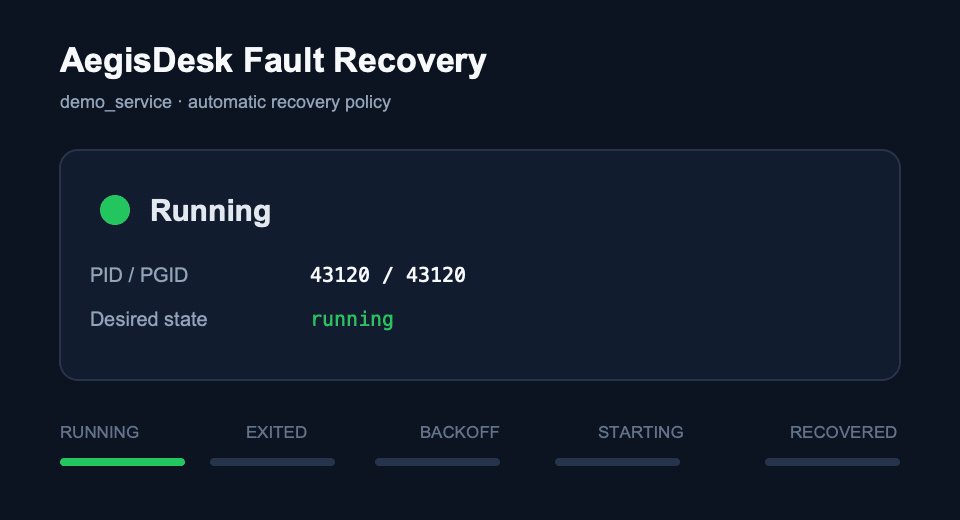

# AegisDesk

## 项目简介

AegisDesk 是一个面向 macOS 与 Linux 的本地进程监督和桌面管理工具。项目采用 C++20 开发，由本地 Agent、Qt 6
桌面客户端和可控故障演示服务组成，支持服务注册、生命周期管理、运行指标采集、健康检查、告警和自动恢复。

项目重点关注进程管理中的可靠性问题，包括并发操作串行化、`fork`/`exec` 启动确认、子进程退出回收、进程组清理、异常退出识别，以及带退避和重启预算的自动恢复。

> 当前项目主要用于个人技术实践和求职作品展示，不建议未经安全加固直接用于生产环境。

## 核心能力

- 基于 `configs/services.json` 注册和管理多个本地服务。
- 提供 `Stopped`、`Starting`、`Running`、`Stopping`、`Exited`、`Failed` 六阶段生命周期状态机。
- 使用独立的 `DesiredState` 区分手动停止和异常退出。
- 通过 close-on-exec 错误管道确认 `execv` 是否真正成功。
- 串行化 Start、Stop 和 Restart，防止并发启动多个子进程。
- 使用独立观察线程统一执行 `waitpid`，避免竞争回收和僵尸进程。
- 为每个服务创建独立进程组，停止时先发送 `SIGTERM`，超时后升级为 `SIGKILL`。
- 支持带退避时间和重启预算的自动恢复策略。
- 采集 CPU、RSS 内存、线程数和文件描述符数量等运行指标。
- 提供健康检查、告警记录、恢复事件和历史指标查询。
- 通过 Qt 6 Desktop 展示服务状态、故障原因、日志、指标和趋势图。
- 提供故障注入、API 回归测试和 100 轮生命周期压力测试。

## 系统架构

```text
┌──────────────────────┐
│ Qt 6 Desktop         │
│ 状态、控制、日志、指标   │
└──────────┬───────────┘
           │ HTTP / JSON
┌──────────▼───────────┐
│ Local Agent          │
│ API、注册表、监控与恢复  │
└──────────┬───────────┘
           │ ProcessSupervisor
┌──────────▼───────────┐
│ Managed Process Group│
│ 主进程及其子孙进程      │
└──────────────────────┘
```

详细设计请参阅：

- [系统架构说明](docs/architecture.md)
- [进程生命周期状态机](docs/state-machine.md)
- [生命周期 API 字段说明](docs/api.md)
- [HTTP Server 性能基线](docs/http-server-performance-baseline.md)
- [HTTP Server 生命周期与配置](docs/http-server-lifecycle.md)

## 项目结构

```text
AegisDesk/
├── CMakeLists.txt
├── apps/
│   ├── agent/              # 本地 Agent、进程监督、指标和恢复逻辑
│   ├── desktop/            # Qt 6 桌面客户端
│   └── demo_service/       # 支持故障注入的演示服务
├── configs/
│   └── services.json       # 服务注册配置
├── docs/                   # API、架构、状态机和演示材料
├── tests/
│   ├── fixtures/           # 可控故障进程
│   ├── integration/        # HTTP Server 等跨组件集成测试
│   ├── support/            # 测试数据构造器
│   └── unit/               # 单元测试和进程集成测试
└── runtime/
    └── logs/               # 本地运行日志
```

## 环境要求

| 依赖      | 最低要求                                 |
|---------|--------------------------------------|
| CMake   | 3.25                                 |
| C++ 编译器 | 支持 C++20 的 Clang 或 GCC               |
| Boost   | 1.74                                 |
| Qt      | Qt 6 Core、Gui、Widgets、Network、Charts |
| 操作系统    | macOS 或 Linux                        |

### macOS

推荐使用 Homebrew 安装依赖：

```bash
brew install cmake boost qt
```

### Ubuntu / Debian

```bash
sudo apt-get update
sudo apt-get install -y \
  cmake \
  ninja-build \
  g++ \
  libboost-all-dev \
  qt6-base-dev \
  libqt6charts6-dev
```

## 构建项目

### Debug 构建

```bash
cmake -S . -B build \
  -DCMAKE_BUILD_TYPE=Debug \
  -DBUILD_TESTING=ON
cmake --build build --parallel
```

### Release 构建

如仅需构建产品目标，可以关闭测试依赖：

```bash
cmake -S . -B build-release \
  -DCMAKE_BUILD_TYPE=Release \
  -DBUILD_TESTING=OFF
cmake --build build-release --parallel
```

主要构建产物如下：

```text
build/apps/agent/agent
build/apps/desktop/desktop
build/apps/demo_service/demo_service
```

## 运行方式

以下命令均在项目根目录执行。

### 启动 Agent

```bash
./build/apps/agent/agent \
  --config configs/services.json \
  --work-dir . \
  --port 18081
```

Agent 默认只作为本地控制面使用。示例端口为 `18081`。

### 启动 Desktop

```bash
./build/apps/desktop/desktop \
  --agent-url http://127.0.0.1:18081
```

Desktop 每秒刷新服务状态。服务处于 `Starting` 或 `Stopping` 时，Start、Stop 和 Restart 按钮会被禁用，避免重复操作。

## 服务配置

服务通过 `configs/services.json` 注册。以下示例展示了主要配置项：

```json
{
  "schema_version": 1,
  "services": [
    {
      "id": "demo_service",
      "display_name": "Demo Service",
      "executable": "build/apps/demo_service/demo_service",
      "work_dir": ".",
      "args": [
        "--name",
        "demo_service",
        "--interval-ms",
        "1000"
      ],
      "log_path": "runtime/logs/demo_service.log",
      "auto_start": false,
      "health_check": {
        "enabled": true,
        "type": "process",
        "interval_seconds": 5,
        "timeout_milliseconds": 1000,
        "failure_threshold": 3
      },
      "recovery_policy": {
        "enabled": true,
        "restart_on_unhealthy": true,
        "restart_on_critical_alert": false,
        "max_restarts": 3,
        "window_seconds": 300,
        "backoff_seconds": 10,
        "startup_grace_seconds": 10
      }
    }
  ]
}
```

配置约束：

- `id` 只能包含字母、数字、下划线和连字符。
- 相对路径以 `--work-dir` 指定的目录为解析基准。
- `auto_start` 为 `true` 时，Agent 启动后会自动启动对应服务。
- 完整示例及告警规则请参阅 [configs/services.json](configs/services.json)。

## Agent HTTP API

### 服务与生命周期

| 方法     | 路径                                            | 说明          |
|--------|-----------------------------------------------|-------------|
| `GET`  | `/api/v1/services`                            | 获取全部服务及当前状态 |
| `GET`  | `/api/v1/services/{service_id}/status`        | 获取单个服务状态    |
| `POST` | `/api/v1/services/{service_id}/start`         | 启动服务        |
| `POST` | `/api/v1/services/{service_id}/stop`          | 停止服务及其进程组   |
| `POST` | `/api/v1/services/{service_id}/restart`       | 重启服务        |
| `GET`  | `/api/v1/services/{service_id}/logs?tail=100` | 获取最近日志      |

### 指标、健康和恢复

| 方法     | 路径                                                        | 说明       |
|--------|-----------------------------------------------------------|----------|
| `GET`  | `/api/v1/services/{service_id}/metrics`                   | 获取最新运行指标 |
| `GET`  | `/api/v1/services/{service_id}/metrics/history?limit=300` | 获取历史指标   |
| `GET`  | `/api/v1/services/{service_id}/health`                    | 获取健康状态   |
| `GET`  | `/api/v1/services/{service_id}/alerts`                    | 获取服务告警   |
| `GET`  | `/api/v1/services/{service_id}/recovery-events?limit=100` | 获取服务恢复事件 |
| `GET`  | `/api/v1/alerts`                                          | 获取全部告警   |
| `GET`  | `/api/v1/alerts/active`                                   | 获取活动告警   |
| `POST` | `/api/v1/alerts/{alert_id}/ack`                           | 确认告警     |
| `GET`  | `/api/v1/recovery-events?limit=100`                       | 获取最近恢复事件 |

调用示例：

```bash
curl -s http://127.0.0.1:18081/api/v1/services

curl -s -X POST \
  http://127.0.0.1:18081/api/v1/services/demo_service/start

curl -s \
  http://127.0.0.1:18081/api/v1/services/demo_service/metrics
```

### 生命周期状态响应

状态接口保留原有 v1 字段，并以追加字段的方式提供进程组和故障诊断信息：

```json
{
  "state": "Running",
  "desired_state": "running",
  "pid": 43120,
  "uptime_seconds": 18,
  "last_exit_code": null,
  "process_group_id": 43120,
  "last_exit_kind": "none",
  "last_exit_signal": null,
  "last_error": "",
  "last_transition_at_unix_ms": 1784250000000
}
```

已有客户端可以忽略新增字段；新版 Desktop 在连接旧版 Agent 时，也会为缺失字段使用兼容默认值。

## 指标采集

Agent 通过平台抽象层采集进程指标：

| 平台    | 实现方式                 |
|-------|----------------------|
| Linux | `/proc` 文件系统         |
| macOS | `libproc` 与 Mach API |
| 其他平台  | 当前不支持                |

指标数据当前保存在内存中。Desktop 的 Overview 页面展示最新指标，Trends 页面通过 Qt Charts 展示历史趋势。

## 测试与质量保障

项目使用 GoogleTest 和 CTest。GoogleTest 使用固定版本，并在启用 `BUILD_TESTING` 时由 CMake 获取。

```bash
cmake -S . -B build \
  -DCMAKE_BUILD_TYPE=Debug \
  -DBUILD_TESTING=ON
cmake --build build --parallel
ctest --test-dir build --output-on-failure
```

当前测试范围包括：

- 数据模型和配置约束测试。
- 健康检查、告警和自动恢复策略测试。
- 启动失败、退出代码和退出信号测试。
- 子进程观察、`waitpid` 回收和僵尸进程检查。
- 进程组终止、`SIGKILL` 升级和子进程清理测试。
- 并发 Start、Stop、Restart 行为测试。
- API 兼容字段和启动失败原因回归测试。
- HTTP Server 随机端口集成测试和并发性能基线。
- HTTP Server Keep-Alive 并发、并发停机、半包超时、客户端断连和连接容量恢复测试。
- HTTP Server 50 轮启停与文件描述符回收测试。
- 100 轮 `Start → Restart → Stop` 生命周期压力测试。

100 轮压力测试会在每轮检查旧 PID 和 PGID 是否已经消失，并确认最终状态恢复为 `Stopped`。

HTTP Server 韧性测试可以通过 CTest 标签独立运行：

```bash
ctest --test-dir build -L resilience --output-on-failure
```

### Sanitizer

AddressSanitizer 与 UndefinedBehaviorSanitizer：

```bash
cmake -S . -B build-asan \
  -DCMAKE_BUILD_TYPE=Debug \
  -DBUILD_TESTING=ON \
  -DAEGIS_ENABLE_ASAN=ON \
  -DAEGIS_ENABLE_UBSAN=ON
cmake --build build-asan \
  --target aegis_agent_core_tests aegis_http_server_tests \
  --parallel
ctest --test-dir build-asan --output-on-failure
```

ThreadSanitizer 必须使用独立构建目录：

```bash
cmake -S . -B build-tsan \
  -DCMAKE_BUILD_TYPE=Debug \
  -DBUILD_TESTING=ON \
  -DAEGIS_ENABLE_TSAN=ON
cmake --build build-tsan \
  --target aegis_agent_core_tests aegis_http_server_tests \
  --parallel
ctest --test-dir build-tsan --output-on-failure
```

> macOS 的 AddressSanitizer 不支持 LeakSanitizer。如运行环境默认启用泄漏检测，可设置 `ASAN_OPTIONS=detect_leaks=0`。Linux
> CI 保留泄漏检测。

## 持续集成

GitHub Actions 工作流位于 `.github/workflows/ci.yml`，包含以下任务：

- macOS Debug 构建与测试。
- macOS Release 构建与测试。
- Linux Debug 构建与测试。
- Linux Release 构建与测试。
- Linux ASan 与 UBSan 检查。
- Linux TSan 检查。

## 故障恢复演示

`demo_service` 提供可重复的故障注入参数：

| 参数                     | 说明                    |
|------------------------|-----------------------|
| `--exit-after N`       | 运行 N 秒后主动退出           |
| `--exit-code CODE`     | 指定主动退出代码              |
| `--ignore-sigterm`     | 忽略 `SIGTERM`，验证强制终止流程 |
| `--spawn-child`        | 创建子进程，验证进程组清理         |
| `--cpu-load-percent N` | 产生指定比例的 CPU 负载        |

自动化测试覆盖以下场景：异常退出后自动恢复、手动停止后不恢复、退避与重启预算、忽略 `SIGTERM` 后强制终止，以及子进程无残留。



## 当前限制

- 进程监督功能依赖 POSIX 接口，当前未实现 Windows 进程管理。
- Agent 的 HTTP 服务定位于本地控制面，尚未实现认证、TLS、权限模型和审计日志。
- 服务配置在 Agent 启动时加载，暂不支持运行时热更新。
- 指标和事件保存在内存中，Agent 重启后不会持久化。
- Desktop 已完成构建验证，但尚未加入 Qt Widget 自动化测试。
