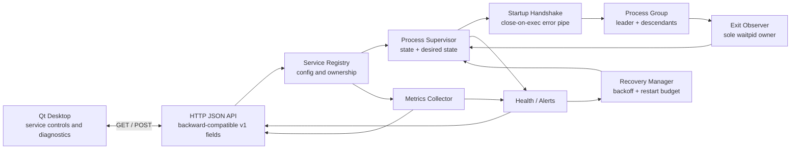

# Architecture

## Concurrency ownership

| Concern | Owner |
| --- | --- |
| Start/stop/restart serialization | Per-service operation mutex |
| Lifecycle snapshot | Per-service state mutex |
| Child reaping | Per-run observer thread |
| Stop completion notification | Observer + condition variable |
| Health/recovery scheduling | Health monitor and recovery manager |
| Descendant cleanup | Dedicated process group |

This separation prevents duplicate children, competing `waitpid` calls, long-held state locks, and zombie processes.
