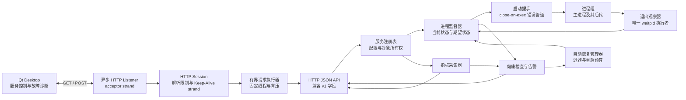

# 系统架构

## 并发职责划分

| 关注点 | 负责组件或机制 |
| --- | --- |
| API 请求可重入性 | 无状态的 `AgentApi`，不使用全局请求互斥锁 |
| HTTP 接收生命周期 | Listener strand 与异步 accept |
| 单连接 I/O | Session 自有 strand 与异步读写 |
| HTTP 资源限制 | 单请求解析限制、单连接请求次数和空闲时间限制 |
| 活跃连接所有权 | Server 的 Session 注册表 |
| 业务请求执行 | 固定数量的 Handler worker，不占用 I/O worker |
| 请求背压 | 有界在途计数覆盖执行中和排队任务，容量耗尽时返回 HTTP 503 |
| HTTP 优雅关闭 | 停止 Listener、排空任务、连接宽限计时器和强制关闭 socket |
| 性能验收 | Release Benchmark 报告，以及成功率、并行加速和资源回收的稳定 CTest 约束 |
| 注册表结构 | 启动阶段加载，之后只进行不可变的并发读取 |
| Start、Stop、Restart 串行化 | 每个服务独立的 operation mutex |
| 生命周期快照 | 每个服务独立的 state mutex |
| 子进程回收 | 每次运行对应的退出观察线程 |
| 停止完成通知 | 观察线程与条件变量 |
| 指标发布 | 采集互斥锁与快照共享互斥锁 |
| 健康状态发布 | 检查互斥锁与快照共享互斥锁 |
| 告警修改与确认 | 告警管理器互斥锁 |
| 恢复状态与事件历史 | 恢复管理器互斥锁 |
| 后代进程清理 | 服务专属进程组 |

这种职责分离可以避免重复创建子进程、多个线程竞争执行 `waitpid`、状态锁被长期持有以及产生僵尸进程。

## HTTP 性能验证

性能验证分为两个层次：

1. `aegis_http_benchmark` 记录短连接、Keep-Alive 和模拟 Handler 工作场景下的吞吐量及 P50/P95/P99 延迟。这些数据只在相同硬件与构建配置下进行版本间比较。
2. `HttpServerPerformanceAcceptanceTest` 提供可跨平台执行的 CI 门槛：50 个并发连接必须全部成功，持续 Keep-Alive 负载结束后不得残留活跃资源，4 个 Handler worker 必须表现出相对于串行执行的并行加速。

这种设计不会将容易受机器性能波动影响的微基准数值作为通用通过门槛，同时仍能及时发现并发性能退化。

## 业务层并发契约

- `ServiceRegistry::LoadFromFile` 只允许在启动阶段调用。加载成功后，服务 ID、服务顺序、服务定义和监督器所有权在注册表生命周期内不再改变。
- `ServiceRegistry::Find`、`ListServices` 和 `Size` 可以在启动完成后并发调用。每个返回的 `ProcessSupervisor` 使用自己的锁保护可变生命周期状态。
- `AgentApi::Handle` 可重入。每次调用独立持有请求、响应、临时字符串和 JSON 构造器；共享状态只能通过已同步的子系统接口访问。
- 指标、健康状态、告警和恢复接口返回值快照。每个子系统的快照自身保持一致，但不同子系统之间不构成跨系统事务。
- 告警确认操作在同一个临界区内返回已经确认的快照，避免“先确认、再读取”产生竞态。
- 关闭顺序为：先停止 HTTP 请求生产者，再停止健康检查和指标采集 worker，最后调用 `ServiceRegistry::StopAll`。注册表析构不能与仍在执行的 API 调用重叠。
