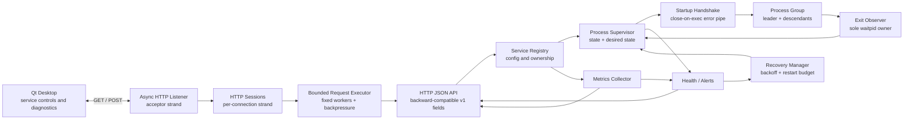

# Architecture

## Concurrency ownership

| Concern | Owner |
| --- | --- |
| API request reentrancy | Stateless `AgentApi`; no global request mutex |
| HTTP accept lifecycle | Listener strand + asynchronous accept |
| Per-connection I/O | Session-owned strand + asynchronous read/write |
| Active connection ownership | Server session registry |
| Business request execution | Fixed Handler workers; never runs on I/O workers |
| Request backpressure | Bounded in-flight counter covering running and queued tasks; overflow returns HTTP 503 |
| Registry topology | Startup load, then immutable concurrent reads |
| Start/stop/restart serialization | Per-service operation mutex |
| Lifecycle snapshot | Per-service state mutex |
| Child reaping | Per-run observer thread |
| Stop completion notification | Observer + condition variable |
| Metrics publication | Collection mutex + snapshot shared mutex |
| Health publication | Check mutex + snapshot shared mutex |
| Alert mutation and acknowledgement | Alert manager mutex |
| Recovery state and event history | Recovery manager mutex |
| Descendant cleanup | Dedicated process group |

This separation prevents duplicate children, competing `waitpid` calls, long-held state locks, and zombie processes.

## Business-layer concurrency contract

- `ServiceRegistry::LoadFromFile` is a startup-only operation. After it succeeds, service IDs, ordering, definitions,
  and supervisor ownership do not change for the registry lifetime.
- `ServiceRegistry::Find`, `ListServices`, and `Size` may run concurrently after startup. Each returned
  `ProcessSupervisor` owns the locks for its mutable lifecycle state.
- `AgentApi::Handle` is reentrant. Every call owns its request, response, temporary strings, and JSON builder; shared
  state is accessed only through synchronized subsystem APIs.
- Metrics, health, alerts, and recovery endpoints return value snapshots. Snapshots from different subsystems are
  individually consistent but are not a cross-subsystem transaction.
- Alert acknowledgement returns the acknowledged snapshot from the same critical section, avoiding a separate
  acknowledge-then-read race.
- Shutdown order is HTTP request producers first, then health and metrics workers, followed by
  `ServiceRegistry::StopAll`. Registry destruction must not overlap active API calls.
