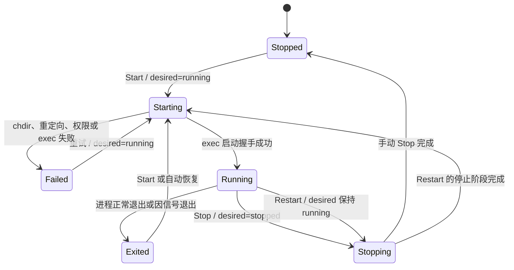

# 进程生命周期状态机

`ServiceState` 记录进程当前所处的实际状态，`DesiredState` 独立记录操作者的期望状态。两者分离后，自动恢复逻辑才能准确区分异常退出和手动停止。

## 状态转换规则

- `Start`、`Stop` 和 `Restart` 通过 operation mutex 串行执行。
- state mutex 只保护状态快照；等待进程退出期间不会持有该锁。
- 只有 close-on-exec 管道确认 `execv` 成功后，状态才会转换为 `Running`。
- 每个运行中的服务由一个观察线程独占执行 `waitpid`，并负责发布退出结果。
- 手动停止会将 `DesiredState` 修改为 `stopped`；异常退出仍保持为 `running`，从而允许恢复策略决定是否重启。
- 停止操作首先向整个进程组发送 `SIGTERM`，超过期限后升级为 `SIGKILL`。
