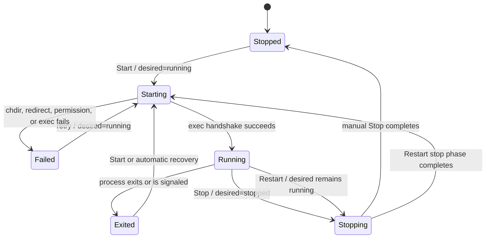

# Process Lifecycle State Machine

`ServiceState` records what the process is doing now. `DesiredState` independently records the operator's intent, which is what allows recovery to distinguish an abnormal exit from a manual stop.

## Transition rules

- `Start`, `Stop`, and `Restart` are serialized by the operation mutex.
- The state mutex protects snapshots only; it is not held while waiting for process exit.
- `Running` is entered only after the close-on-exec pipe confirms a successful `execv`.
- One observer thread owns `waitpid` for each running service and publishes the exit result.
- A manual stop changes `DesiredState` to `stopped`; an abnormal exit leaves it as `running`, enabling policy-driven recovery.
- Stop targets the process group with `SIGTERM`, then escalates to `SIGKILL` after the deadline.
